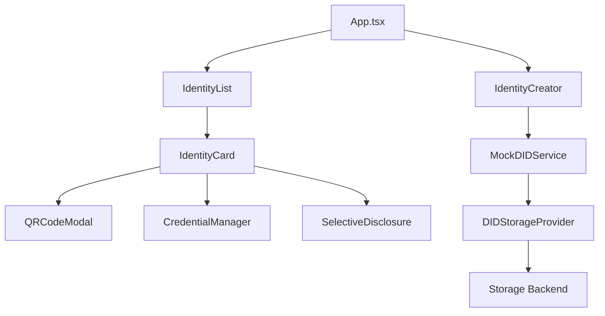
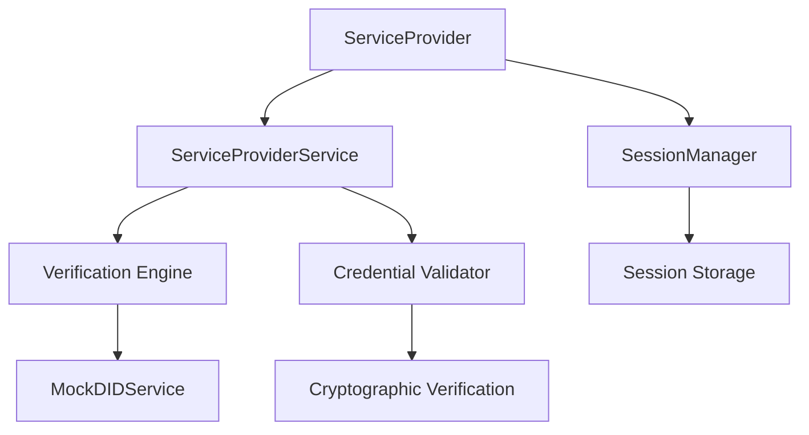

# System Architecture

## 🎯 Overview

The Anonymous Identity Creator follows a modern, layered architecture designed for scalability, maintainability, and security. The system is built using React/TypeScript with a clear separation of concerns across presentation, service, and storage layers.

## 🏗️ Architectural Layers

### 1. Presentation Layer (React Components)
The presentation layer consists of modular React components organized by functionality:

```
src/components/
├── Identity Management
│   ├── IdentityCreator.tsx      # Identity creation form
│   ├── IdentityList.tsx         # Identity display grid
│   ├── IdentityCard.tsx         # Individual identity display
│   ├── SelectiveDisclosure.tsx  # Privacy-preserving sharing
│   └── CredentialManager.tsx    # Credential lifecycle management
├── Service Provider
│   ├── ServiceProvider.tsx      # Verification interface
│   └── SessionManager.tsx       # Session management
├── Storage Configuration
│   ├── StorageConfig.tsx        # Legacy storage configuration
│   └── DIDStorageConfig.tsx     # DID storage configuration
└── Common
    └── QRCodeModal.tsx          # QR code generation and sharing
```

### 2. Service Layer
The service layer provides business logic abstraction and external integration:

```
src/services/
├── mockDIDService.ts            # Browser-compatible DID operations
└── serviceProviderService.ts    # Verification and session management

src/utils/
├── anonIdentity.ts             # Legacy identity operations
├── crypto.ts                   # Cryptographic utilities
├── storage.ts                  # Storage provider factory
└── didStorage.ts               # DID-aware storage abstraction
```

### 3. Data Layer
The data layer handles persistence and state management:

```
src/types/
├── identity.ts                  # Core identity and credential types
├── serviceProvider.ts          # Service provider and verification types
├── storage.ts                  # Storage configuration types
└── transfer.ts                 # Data transfer types

Storage Providers:
├── Memory Storage              # In-memory storage for development
├── Local Storage              # Browser localStorage
├── Session Storage            # Browser sessionStorage
├── IndexedDB Storage          # Browser database
└── Hybrid Storage             # Multiple provider redundancy
```

## 🔄 Component Architecture

### Identity Management Flow


### Service Provider Flow


## 🎨 Design Patterns

### 1. Factory Pattern
Used for storage provider creation:
```typescript
// Storage factory implementation
export function createStorageProvider(type: StorageType): StorageProvider {
  switch (type) {
    case 'memory': return new MemoryStorageProvider()
    case 'localStorage': return new LocalStorageProvider()
    case 'indexedDB': return new IndexedDBStorageProvider()
    default: return new MemoryStorageProvider()
  }
}
```

### 2. Strategy Pattern
Implemented for different verification strategies:
```typescript
// Verification strategy selection
if (verificationMode === 'single') {
  result = await ServiceProviderService.verifyCredential(...)
} else if (verificationMode === 'batch') {
  result = await ServiceProviderService.verifyCredentialsBatch(...)
}
```

### 3. Observer Pattern
React's component lifecycle and state management follow observer patterns for reactive updates.

### 4. Adapter Pattern
MockDIDService adapts anon-identity library for browser compatibility:
```typescript
export class MockDIDService {
  static async createDIDIdentity(name: string, attributes: IdentityAttributes): Promise<DIDIdentity>
  static async createVerifiablePresentation(didIdentity: DIDIdentity): Promise<MockVerifiablePresentation>
  static async verifyPresentation(presentation: MockVerifiablePresentation): Promise<boolean>
}
```

## 🔧 Key Architectural Decisions

### 1. Dual Mode Architecture
The system supports both legacy and DID/VC modes:
- **Legacy Mode**: Simple key-pair based identities
- **DID Mode**: W3C-compliant DIDs with Verifiable Credentials

### 2. Storage Abstraction
Pluggable storage system supports multiple backends:
- Development: Memory storage
- Production: IndexedDB or hybrid storage
- Privacy: Session storage with auto-cleanup

### 3. Service Layer Separation
Clear separation between UI components and business logic:
- Components handle presentation and user interaction
- Services handle business logic and external integration
- Utilities provide shared functionality

### 4. Type Safety
Comprehensive TypeScript types ensure compile-time safety:
- Strict type checking for all data structures
- Interface segregation for different concerns
- Generic types for reusable patterns

## 🔐 Security Architecture

### 1. Cryptographic Layer
```
┌─────────────────────────────────────────────────────┐
│                Web Crypto API                      │
├─────────────────────────────────────────────────────┤
│  ┌─────────────┐  ┌─────────────┐  ┌─────────────┐  │
│  │ Key         │  │ Signature   │  │ Random      │  │
│  │ Generation  │  │ Verification│  │ Generation  │  │
│  └─────────────┘  └─────────────┘  └─────────────┘  │
└─────────────────────────────────────────────────────┘
```

### 2. Storage Security
- Sensitive data encryption before storage
- Secure key management practices
- Session-based temporary storage options

### 3. Verification Security
- Cryptographic proof verification
- Issuer trust validation
- Revocation status checking
- Timestamp validation

## 📊 Performance Considerations

### 1. Component Optimization
- React.memo for expensive components
- useMemo for complex calculations
- useCallback for stable references
- Lazy loading for large components

### 2. Storage Optimization
- Efficient serialization/deserialization
- Compression for large datasets
- Indexed access patterns
- Batch operations for multiple records

### 3. Verification Optimization
- Parallel verification for batch operations
- Caching for repeated verifications
- Optimized cryptographic operations
- Progressive result display

## 🔄 Data Flow Architecture

### 1. Identity Creation Flow
```
User Input → Validation → DID Generation → Credential Issuance → Storage → UI Update
```

### 2. Verification Flow
```
Credential Input → Signature Verification → Trust Validation → Revocation Check → Result Display
```

### 3. Session Management Flow
```
Session Creation → Permission Setup → Activity Tracking → Expiration Monitoring → Cleanup
```

## 🧪 Testing Architecture

### 1. Unit Testing
- Component testing with React Testing Library
- Service testing with Jest
- Utility function testing
- Type validation testing

### 2. Integration Testing
- End-to-end user workflows
- Storage provider integration
- Service layer integration
- Cross-component communication

### 3. Security Testing
- Cryptographic operation validation
- Input sanitization testing
- Authentication flow testing
- Authorization boundary testing

## 🚀 Deployment Architecture

### 1. Build Process
```
TypeScript Compilation → Vite Bundling → Asset Optimization → Production Build
```

### 2. Runtime Environment
- Modern browser requirements
- Web Crypto API availability
- Local storage permissions
- HTTPS for security features

### 3. Configuration Management
- Environment-based configuration
- Feature flags for different modes
- Storage provider selection
- Security parameter tuning

## 📈 Scalability Considerations

### 1. Component Scalability
- Modular component design
- Reusable component patterns
- Configurable component behavior
- Extension points for new features

### 2. Storage Scalability
- Multiple storage backend support
- Efficient data structures
- Pagination for large datasets
- Background synchronization

### 3. Service Scalability
- Stateless service design
- Parallel processing capabilities
- Caching strategies
- Load distribution patterns

This architecture provides a solid foundation for identity management systems while maintaining flexibility for future enhancements and integrations.